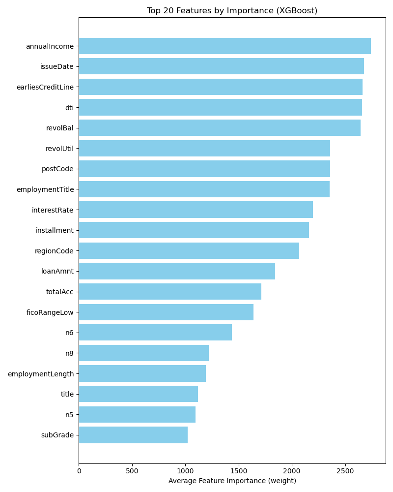

# Financial Risk Prediction | 金融风控违约预测

## 项目简介

本项目是**机器学习项目**。

**项目背景：**
金融风险评估是金融科技领域的关键问题。本项目基于某金融机构提供的用户贷款数据，利用机器学习算法预测用户是否存在违约风险（`isDefault`），并输出预测概率及特征重要性分析，为资产安全和收益控制提供技术支持。

**主要成果：**
- 构建了基于 **XGBoost** 的二分类预测模型。
- 实现了完整的数据预处理流水线（缺失值填补、Target Encoding、标准化）。
- 在 5 折交叉验证中取得了 **0.7351** 的平均 AUC 分数。

## 实验环境与依赖

本项目基于 Windows 11 + Anaconda 开发，主要依赖库版本如下：

- **Python**: 3.12
- **XGBoost**: 3.0.2
- **Pandas**: 2.2.2
- **Scikit-learn**: 1.5.1
- **Category Encoders**: 2.8.1
- **Matplotlib**: 3.9.2

安装依赖：
```bash
pip install pandas numpy xgboost scikit-learn category_encoders matplotlib

## 算法原理与流程

### 1. 数据预处理
- **缺失值处理**：数值特征使用中位数（Median）填充，类别特征使用常量（'missing'）填充。
- **特征编码**：类别特征采用 **TargetEncoder**（目标变量平滑期望值）进行编码。
- **数据标准化**：数值特征使用 `StandardScaler` 进行标准化，加速模型收敛。

### 2. 模型构建
- **核心模型**：XGBoost (eXtreme Gradient Boosting)。
- **训练策略**：
  - 使用 `StratifiedKFold` (5折) 进行分层交叉验证。
  - 启用 `early_stopping_rounds=50` 防止过拟合。
  - 使用 `scale_pos_weight` 处理正负样本不平衡问题。
  - `tree_method='hist'` 提升训练效率。

---

## 实验结果

模型在验证集上的表现稳定，具有良好的泛化能力。

| 折数 (Fold) | 验证集 AUC |
| :--- | :--- |
| Fold 1 | 0.7357 |
| Fold 2 | 0.7351 |
| Fold 3 | 0.7340 |
| Fold 4 | 0.7367 |
| Fold 5 | 0.7341 |
| **平均 (Mean)** | **0.7351** |

### 特征重要性 (Feature Importance)
下图展示了模型训练中权重（Weight）排名前 20 的特征：



---

## 文件结构

```text
├── main.py                  # 完整的主程序代码（数据处理+训练+预测）
├── Result.csv               # (Generated) 最终提交的预测结果
├── feature_importance.png   # (Generated) 特征重要性可视化图表
└── README.md                # 项目说明文档
```

---

## 运行指南
1. 确保目录下包含 `train.csv` 和 `testA.csv` 数据文件。
2. 运行主脚本：
   ```bash
   python main.py
   ```
3. 运行结束后：
   - 控制台将输出每一折的 AUC 及 平均 AUC。
   - 根目录将生成预测结果文件 `Result.csv`。
   - 根目录将生成特征重要性图表 `feature_importance.png`。

---
